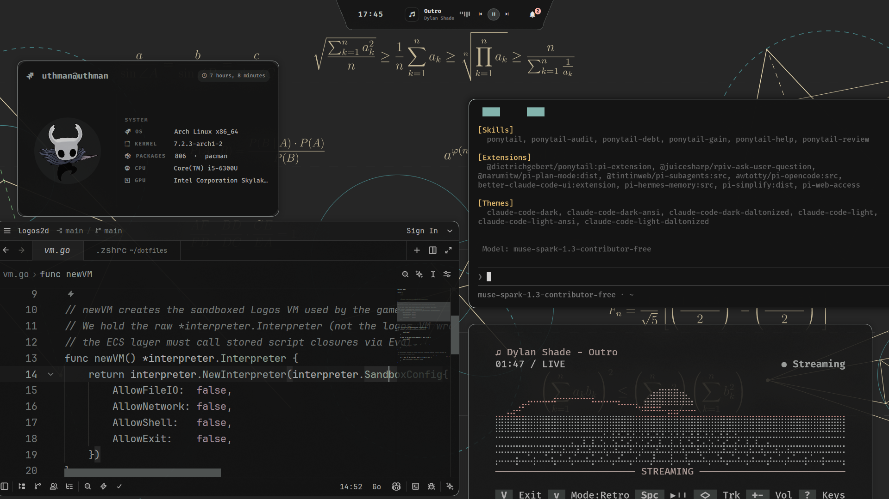
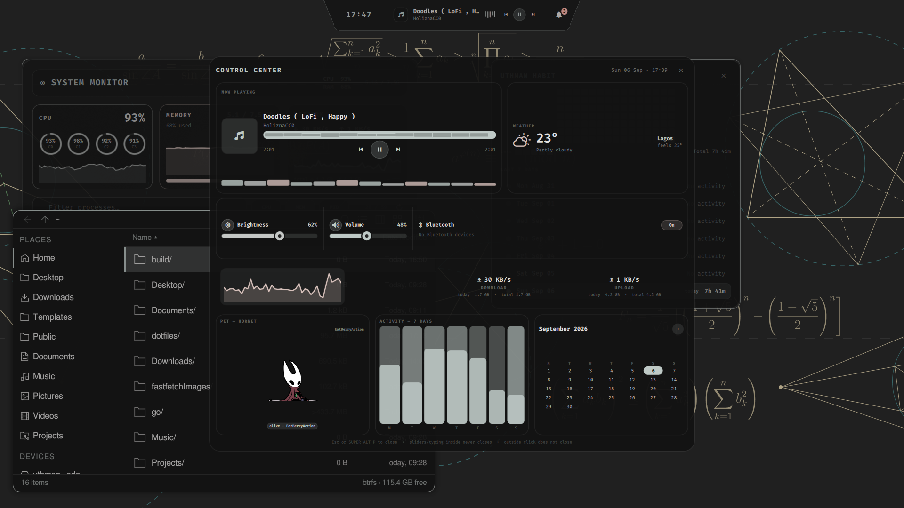

# .files — Complete Desktop Environment (DE) Rice

> **Arch Linux & Omarchy** · **Hyprland** (Wayland) · **Quickshell** (Desktop Shell) · **Matugen** (Material You Dynamic Theming)

A complete, standalone, production-ready Desktop Environment. Built around [Hyprland](https://hyprland.org) for smooth Wayland tiling, [Quickshell](https://quickshell.outfoxxed.me) for responsive glassmorphic UI panels and widgets, and [Matugen](https://github.com/InioX/matugen) to dynamically extract and inject color palettes across your entire system from any wallpaper in real time — including the login screen (SDDM).





---

## ⚡ Quick Start (Single-Pull Deployment)

To adapt this complete desktop environment on a new installation or existing Arch machine:

```bash
# 1. Clone your repository
git clone https://github.com/KHOJAH/.files.git ~/.files
cd ~/.files

# 2. Run the automated installer
chmod +x install.sh
./install.sh
```

### What `install.sh` Does:
1. **Environment Detection:** Automatically detects whether you are running **Omarchy Linux** or **Standard Arch Linux** and configures the appropriate Hyprland pipeline (Omarchy Lua bootstrap vs. standalone `.conf`).
2. **Automated Dependency Installation:** Detects your package manager / AUR helper (`yay`, `paru`, or `pacman`), identifies any missing packages, and prompts to install them in a single batch.
3. **Safe Backup:** Automatically detects existing configuration files and backs them up to a timestamped folder (`~/.config-backup-<timestamp>`) before stowing.
4. **Dotfile Deployment:** Deploys configurations using GNU Stow (with automatic fallback to script symlinking if Stow is unavailable).
5. **Dynamic Theming & Fallback:** Deploys theme directories (`~/.config/theme/current`), seeds fallback palettes, and wires theme integration links (btop, cava, GTK, Zed, Ghostty).
6. **System Extras (Requires sudo):** Installs the custom **SDDM `elarun-custom`** greeter, the vendored **Iceland** display font, and sets up SDDM theme drop-ins.
7. **Artwork & Firefox Theming:** Copies Hollow Knight fastfetch artwork and activates live Material You `userChrome.css` / `userContent.css` in Firefox.
8. **Initial Palette Generation:** Prompts to select and apply a wallpaper from the included collection to generate your initial colors live.

To run non-interactively (e.g. in automated setups):
```bash
./install.sh -y
```

---

## 🧩 The Desktop Environment Stack

| Layer | Component | Description |
| :--- | :--- | :--- |
| **Compositor** | [Hyprland](https://hyprland.org) | Smooth, gesture-enabled Wayland tiling compositor with fluid animations, blur, and window grouping. |
| **Shell & Panels** | [Quickshell](https://quickshell.outfoxxed.me) | Custom QML desktop shell: dynamic top bar (capsule/trapezoid island), control center, notifications, volume/brightness OSD, and system monitor. |
| **Dynamic Theming** | [Matugen](https://github.com/InioX/matugen) | Material You palette engine. Generates 42 synchronized configs live on wallpaper change. |
| **Terminal** | [Ghostty](https://ghostty.org) | Modern GPU-accelerated Wayland terminal natively synced with Matugen colors. |
| **Code Editor** | [Zed](https://zed.dev) & Neovim | High-performance editor with Matugen themes; Neovim lazy.nvim config with full LSP support. |
| **Shell & CLI** | Zsh + Starship | Fast shell prompt with Starship, `zoxide`, `fzf`, `lsd`, and completions. |
| **Launchers** | Walker & Rofi | Fast application launcher, clipboard history manager (`cliphist`), and emoji picker. |
| **Audio Visualizer** | Cava & Cavasik | Real-time audio bar visualizer with custom OpenGL shaders integrated into Quickshell. |
| **System Monitors** | btop & QuickSysmon | Hardware resource monitor (CPU core rings, RAM, disk, GPU) and process manager. |
| **Login Greeter** | SDDM (`elarun-custom`) | Minimalist lock & login screen with Hollow Knight mask and dynamic Matugen palette integration. |
| **Idle & Lock** | Hyprlock, Hypridle, Hyprsunset | Session locking, DPMS screen timeout, and blue-light nightlight filter. |

---

## 🎨 Dual Support Architecture: Omarchy & Arch Linux

This repository is engineered to work seamlessly on both **Omarchy** and **Standard Arch Linux**:

- **Omarchy Linux Mode:** Uses the Lua-based bootstrap (`~/.config/hypr/hyprland.lua`, `bindings.lua`, `autostart.lua`, `monitors.lua`), tying into Omarchy's system services and uwsm session wrappers.
- **Standard Arch Linux Mode:** Uses modular Hyprland `.conf` files (`~/.config/hypr/hyprland.conf`, `bindings.conf`, `autostart.conf`, `monitors.conf`), sourcing vendored defaults from `.config/hypr/vendor/` with zero external distro requirements.

`install.sh` automatically detects which environment you are running and activates the appropriate configuration without manual intervention.

---

## 🌈 How Dynamic Theming Works

Every time you change your wallpaper, Matugen extracts the dominant color tones and generates a full Material You color palette. This is immediately broadcast to all applications live:

```bash
# Change wallpaper and recolor the entire DE:
~/.local/bin/set-wallpaper ~/wallpapers/wallhaven-6lyv5x.png

# Or directly with matugen:
matugen image ~/Pictures/wallpaper.png --mode dark --type scheme-fidelity --contrast 0.2
```

### Affected Applications:
- **Quickshell:** UI bar colors, glass tint, hover states, island borders (`colors.css`).
- **Ghostty & Terminals:** Terminal background, foreground, and 16 ANSI color registers.
- **Hyprland:** Active border gradient, inactive borders, and shadow tints (`colors.conf`).
- **Hyprlock & SDDM:** Lock screen and login greeter palette (`Palette.qml`).
- **GTK 3 / 4:** Window headerbars, buttons, and accents (`gtk.css`).
- **Zathura & Fastfetch:** PDF reader theme and fetch artwork color alignment.
- **Zed Editor:** Editor syntax tokens and background (`matugen.json`).
- **Btop & Cava:** System monitor graphs and audio visualizer spectrum colors.

---

## ⌨️ Keybindings Quick Reference

### Window Management
| Keybinding | Action |
| :--- | :--- |
| `SUPER + Z` | **Close active window** |
| `SUPER + Left / Right / Up / Down` | Focus window in direction (or `H`/`J`/`K`/`L`) |
| `SUPER + SHIFT + Left / Right / Up / Down` | Move active window |
| `SUPER + 1 - 9` | Switch to workspace 1 - 9 |
| `SUPER + SHIFT + 1 - 9` | Move window to workspace 1 - 9 |
| `SUPER + F` | Toggle fullscreen |
| `SUPER + SHIFT + SPACE` | Toggle window floating |

### Applications & Launchers
| Keybinding | Action |
| :--- | :--- |
| `SUPER + RETURN` | Launch **Ghostty** terminal |
| `SUPER + SPACE` | Launch **Application Launcher** |
| `SUPER + E` | Open **Theme / Wallpaper Switcher** |
| `SUPER + V` / `SUPER + CTRL + V` | Open **Clipboard Manager** (`cliphist`) |
| `SUPER + K` | Show **Interactive Keybindings Browser** |
| `SUPER + N` | Toggle **Fastfetch System Info Window** |
| `SUPER + ESC` / `XF86PowerOff` | Open **Power / Session Menu** |

### Quickshell Desktop Controls
| Keybinding | Action |
| :--- | :--- |
| `SUPER + ALT + P` | Open **Control Center** (Quick settings, sliders, media) |
| `SUPER + B` | Toggle Top Bar visibility (full-screen focus mode) |
| `SUPER + ALT + SPACE` | Toggle Island Style (**Capsule** vs **Trapezoid**) |
| `SUPER + U` | Open **System Resource Monitor** |
| `SUPER + H` | Open **WiFi & Network Controls** |
| `SUPER + ALT + B` | Open **Battery & Power Profiles Panel** |
| `SUPER + COMMA` | Open **Notification Center** |
| `SUPER + SHIFT + COMMA` | Toggle **Do Not Disturb (DND)** |
| `SUPER + CTRL + SPACE` | Open **Wallshelf** Wallpaper Shelf |
| `SUPER + ALT + V` | Toggle **Desktop Audio Visualizer** |

---

## 📁 Repository Structure

```
~/.files/
├── .config/
│   ├── hypr/                 # Hyprland configs (Dual-mode: .conf & .lua)
│   ├── quickshell/           # Quickshell desktop shell (Bar, Modules, QML)
│   ├── ghostty/              # Ghostty terminal config
│   ├── matugen/              # Matugen dynamic theme templates
│   ├── zed/                  # Zed editor settings & themes
│   ├── nvim/                 # Neovim lua configuration
│   ├── btop/                 # btop monitor config
│   ├── cava/                 # Audio visualizer & shaders
│   ├── fastfetch/            # System fetch configuration
│   ├── rofi/                 # Rofi launchers & scripts
│   ├── swayosd/              # OSD indicators config
│   ├── starship.toml         # Starship prompt configuration
│   └── ...
├── .local/
│   ├── bin/                  # Helper CLI utilities (set-wallpaper, getTheme, etc.)
│   └── share/                # Desktop entries, portals, and icons
├── assets/
│   ├── fonts/                # Vendored display fonts (Iceland-Regular.ttf)
│   ├── fastfetch/            # Hollow Knight fetch artwork
│   └── screenshots/          # Showcase screenshots
├── wallpapers/               # Curated high-res desktop wallpapers
├── sddm/
│   └── elarun-custom/        # Custom SDDM login theme
├── theme-fallback/           # Pre-compiled fallback color configurations
├── firefox/                  # user.js & browser customization helpers
├── panel/                    # Lightweight desktop panel server
├── .gtkrc-2.0                # GTK 2 theme settings
├── .zshrc                    # Zsh shell configuration
├── .gitignore                # Strict ignore rules (no secrets/tokens/caches)
├── install.sh                # Complete automated installation script
└── README.md                 # Documentation & user manual
```

---

## 🔄 Adapting or Updating Configurations

Whenever you update your configurations in `~/.files`:

```bash
# Pull the latest changes
cd ~/.files
git pull

# Re-run installer to link any newly added configs and reload
./install.sh -y

# Reload Hyprland live
hyprctl reload
```

---

## 🔒 Security & Privacy Guarantee

This repository is configured with strict `.gitignore` filters. Private SSH keys, GPG keys, browser profile databases (`places.sqlite`, `cookies.sqlite`, logins), 1Password / Signal vaults, GitHub / Copilot authentication tokens, and shell histories (`.zsh_history`) are **strictly excluded** from git tracking.
